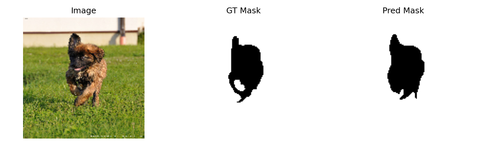

# Pet Segmentation with U-Net (Oxford-IIIT Pet)

TensorFlow + TFDS implementation of a simple U-Net for pet segmentation (trimap: background / pet / border).
Includes training, evaluation, and a Streamlit demo app.

## Dataset
Oxford-IIIT Pet via `tensorflow_datasets` (`oxford_iiit_pet`).

## Setup (Windows)
```bash
python -m venv .venv
.venv\Scripts\activate
pip install -r requirements.txt
```
## train
```bash
python train.py
```
Saves best model to: outputs/best_unet.keras

## Evaluate (Baseline)
```bash
python test.py
```

## Demo (Streamlit)
```bash
streamlit run app.py
```


## Experiments

| Exp           | Classes | IMG_SIZE | Loss  | mIoU  | Dice  |
|---------------|--------:|---------:|------:|------:|------:|
| trimap_128    | 3       | 128      | 0.2704 | 0.7255 | 0.8273 |
| binary_128    | 2       | 128      | 0.1623    | 0.8558    | 0.9211    |


## Qualitative Results


| 3-class (trimap)            | 2-class (binary)              |
|-----------------------------|-------------------------------|
|  |  |


## Project Structure

```md
- `train.py` training script
- `test.py` evaluation + saves prediction samples to `outputs/`
- `app.py` Streamlit inference UI
- `assets/` images used in README
- `outputs/` generated files (ignored by git)
```
